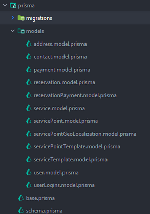
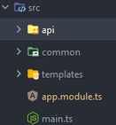
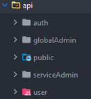
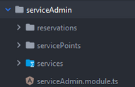
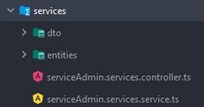
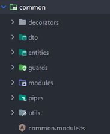
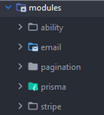

# Foldery i ich role

## prisma

W folderze z prismą powinniśmy trzymać folder z wszystkimi modelami. 
Rozrzucenie ich po całym projekcie nie jest dobrym pomysłem ze względu na późniejsze problemy z ich odszukaniem.

## src

W folderze wydzieliłem 3 główne moduły:

- `api`
- `common`
- `templates` - Przydatne tylko w przypadku gdy korzystamy z MVC lub w jakimś celu generujemy widoki

## api

Dobrą konwencją jest wyodrębnienie kilku folderów które będą określać poziom dostępności do znajdujących się poniżej endpintów

Następnie każdy z tych folderów będzie posiadać własny zestaw funkcjonalności które będą wyodrębnione w osobnych folderach.  
Plik `serviceAdmin.module.ts` importuje wszystkie znajdujące się w folderze serviceAdmin controllery i sewisy, 
następnie ten moduł jest importowany do `app.module.ts`

We wnętrzu każdego folderu wykonujemy standardowe operacje 

## common

Przetrzymuje wszystkie przydatne globalnie dekoratory, moduły, typy etc

## modules

Wszystkie paczki które nie są ściśle związane z projektem i mogą łatwo zostać przeniesione do innego projektu proponuję trzymać w folderze modules.

