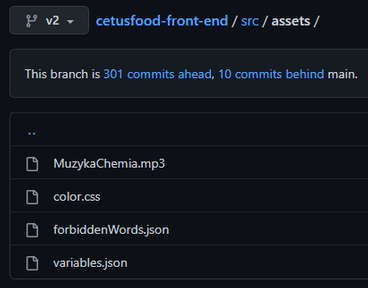
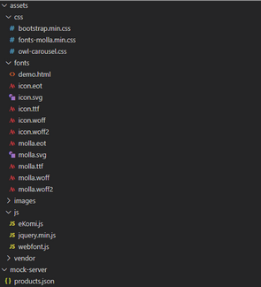

# Nazewnictwo w projekcie

## Przejrzystość zmiennych

Najważniejszą zasadą jest, żeby wszystkie nazwy były zrozumiałe dla innych programistów w zespole.
Dobry kod powinno czytać się jak książkę.
Nazwy zmiennych w kodzie mogą być nawet bardzo długie, najważniejsze jest to, aby po przeczytaniu nazwy każdy miał pewność co dana nazwa oznacza.  

Łatwiej jest wtedy domyśleć się zachowania kodu:
```ts
const msgs = 100; // vs...
const MAX_MESSAGES_PER_MINUTE = 100;
```

Nazwy powinny być czytelne i zrozumiałe. Nie należy stosować nazw typu 'getData'. 
Gdy będziemy używać tego typu nazw, to taki kod będzie mało zrozumiały dla innych programistów z naszego zespołu. 

Lepszą praktyką jest stosowanie nazw typu 'getUserById' - tego typu nazwa będzie bardziej zrozumiała dla innych programistów, 
co znacznie ułatwi i umili pracę nad projektem.
```ts
// Czy z pierwszej funkcji możemy się domyślić więcej, czy z drugiej?
// Takie decyzje mogą mieć duży wpływ na generalną czytelność kodu.
getData(id);
getUserDataById(id);

```

```markdown
# TODO - Notatka edytora
Nie mam dobrych przykładów, ale w dokumentacji warto jest często umieszczać przykłady 
i uzasadnienia zapisanych zasad.
```

## Struktura plików kodu źródłowego

Praktyki z nazewnictwem powinny być stosowane nie tylko do nazw funkcji, metod czy zmiennych, lecz także do nazw plików oraz folderów. 

## Struktura zasobów strony internetowej

Warto podzielić folder assets na podfoldery takie jak: `scss`, `images`, `audio`, dzielone przez typ pliku.

### Zła organizacja plików


### Dobra organizacja plików


## Użycie Języka Polskiego

Wszystkie nazwy w kodzie powinny być napisane w języku angielskim - bez wyjątku ;D

## Casing

Wszystkie nazwy powinniśmy pisać z małej litery, za wyjątkiem komponentów oraz nazw klas w programowaniu obiektowym. Zwykłe nazwy powinny być w formie `getUsers`, błędnym zapisem zwykłej zmiennej byłoby zastosowanie nazwy `GetUsers`. 

```markdown
# TODO - Notatka edytora
Nie lepiej po prostu wytłumaczyć czym jest, 
i jak się używa camelCase? a co z snake_case?
```