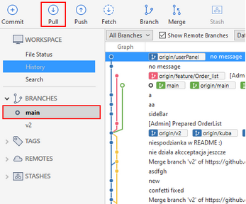
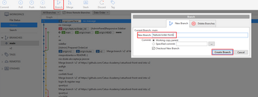
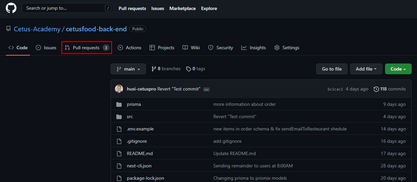
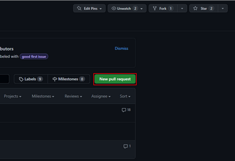
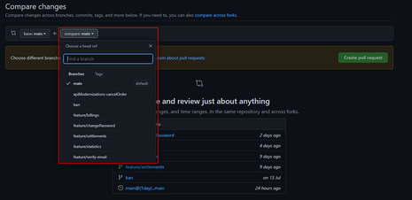
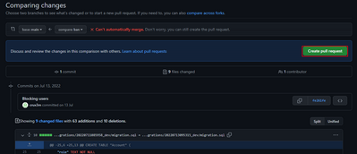
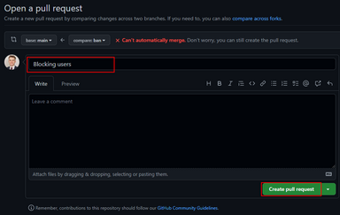
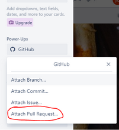

# Praca nad nowym zadaniem - instrukcja

## Tworzenie nowej gałęzi

- Przejdź na główną gałąź (najczęściej main), pobierz zmiany klikając przycisk “Pull”
    

- Kliknij przycisk “Branch” i w polu “New Branch” podaj nazwę swojej gałęzi po angielsku poprzedzając nazwę frazą `feature/` np. `feature/order-form`

- Po wciśnięciu przycisku “Create Branch” utworzy Ci się gałąź do której możesz wysyłać swoje zmiany tworząc commity 

## Tworzenie Pull Request’a w GitHub

- Przejdź do repozytorium na GitHub i przejdź do zakładki “Pull Requests”

- Z lewej strony znajduje się przycisk “New Pull Request” który należy kliknąć

- Rozwiń listę zaznaczoną na zrzucie ekranu i wybierz z tej listy swoją gałąź

- Po wybraniu gałęzi kliknij przycisk “Create Pull Request”

- Wpisz odpowiedni tytuł Pull Request’a (najlepiej skopiuj nazwę swojego zadania z Trello) i kliknij przycisk “Create Pull Request”

- Po utworzeniu Pull Requesta przejdź do Trello i w zadaniu nad którym pracowałeś kliknij ikonę “GitHub”, później kliknij przycisk “Attach Pull Request” i wybierz swój Pull Request:

- Gotowe zadanie należy przenieść na listę “Review”
